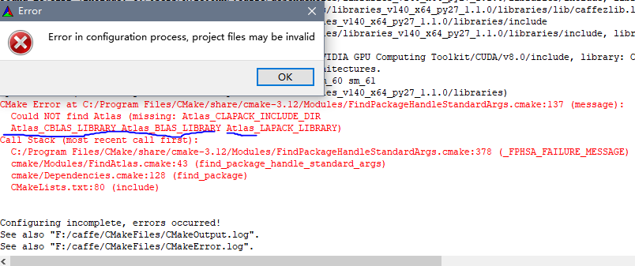
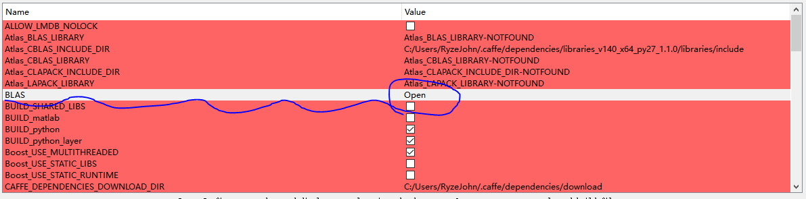
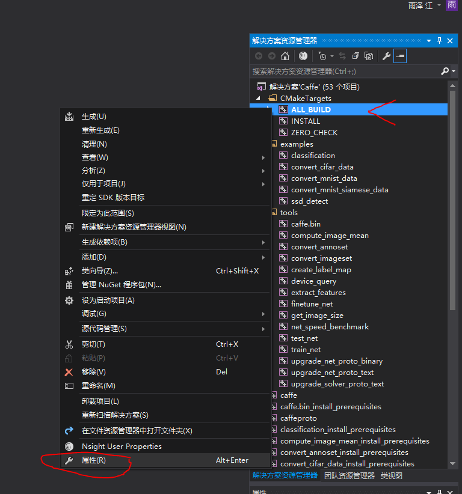
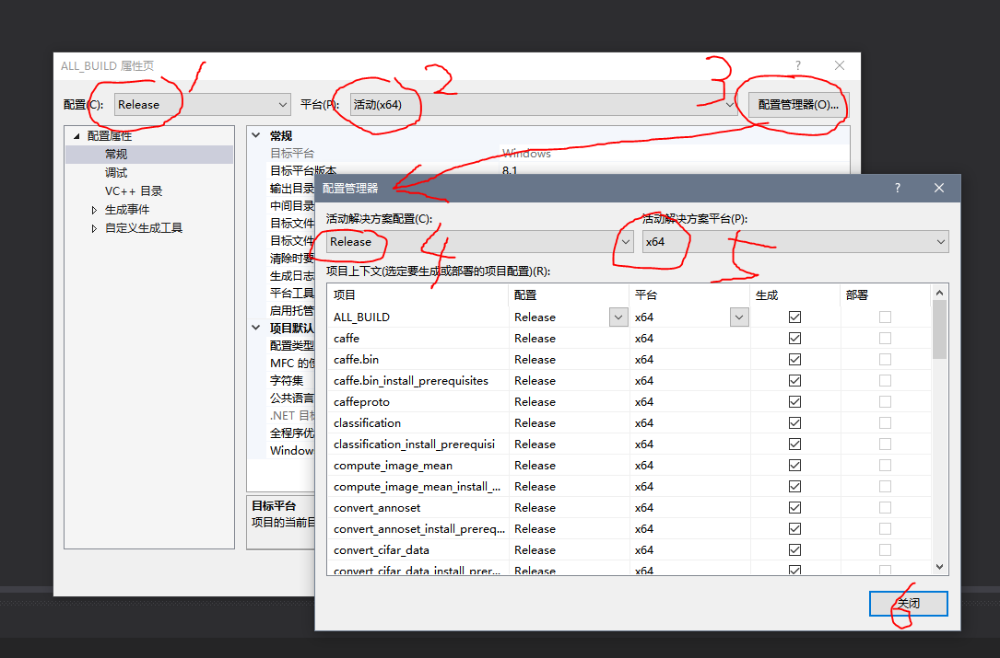
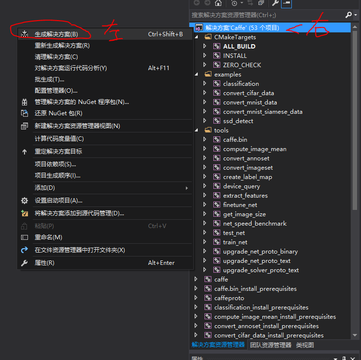

[toc]

# S3FD-Windows-Caffe
**这个工程是从 [runhang的工程](https://github.com/runhang) 修改而来，在这里表示感谢**
**(This work is based on [runhang work](https://github.com/runhang). Thanks for runhang's work.)**

## Requirements
 - Visual Studio 2013 (**Only with Python2.7**) or 2015 (**with Python 2.7 and Python 3.5**)
    我的 IDE 是 [Visual Studio 2015](https://pan.baidu.com/s/1vJn86BUj3DpCs6mK-aqzcg)，Python 是用 [Anaconda3](https://www.anaconda.com/download/) 配的一个 Python2 的环境。当然如果用别的 Python 也可以，工程里面修改 Python 的路径，只要改成自己的 Python 路径就可以了。
 - [CMake](https://cmake.org/download/) 3.4 or higher (Visual Studio and [Ninja](https://ninja-build.org/) generators are supported)
    我用的是当时的最新稳定版 CMake (Latest Release 3.12.4)。并没有下载 Ninja（直接使用 VS2015 就可以）。
 - [CUDA8.0](https://pan.baidu.com/s/1JtZe6eib7_-2rfBuK-KwOA) and [CuDNNv5](https://pan.baidu.com/s/1Ke_SF8DhKdPa4Tmun17ihA)
    上面给的链接是百度云链接。(The link above is Baidu cloud.)

**注意**：在安装上面的东西的时候，需要把之前安装过的不同版本的软件卸载干净，（比如CUDA9，VisualStudio2017等等），且在安装的过程中如果跳出来让你选择是否添加至系统路径的选项的时候，一律选择是，VS安装的过程中注意要安装C++工具，默认是不安装C++工具的。

## Building only for CPU
If CUDA is not installed Caffe will default to a CPU_ONLY build. If you have CUDA installed but want a CPU only build you may use the CMake option -DCPU_ONLY=1.
因为我的电脑是带 GPU 的，所以 CPU 的编译我没有在意，[这个是原始工程的链接](https://github.com/runhang/caffe-ssd-windows)，希望对你有帮助。

## Building only for GPU
1. **找一个路径，下载 [这个工程](www.baidu.com)。**
    后面都假设把工程下载到了 `D:` 盘，并且解压缩命名为 `caffe-source`；如果用的是`git clone`，那也假设工程的最终路径也是 `D:\\caffe-souce`
2. **修改 `D:\\caffe-souce\\scripts\\build_win.cmd` 文件里面的内容。**
    使用文本编辑器（或者各种杂七杂八IDE）打开之后，根据你的Python路径修改第25行的内容。由于我的Python是用Anaconda3新建的并且自己命名为了caffe-py27，所以我第25行的内容是`set CONDA_ROOT=C:\ProgramData\Anaconda3\envs\caffe-py27`，根据自己的需要来改就行。如果用的是 Python3，那就修改第 29 行的内容，并且把第 14 行的`if NOT DEFINED PYTHON_VERSION set PYTHON_VERSION=2`中的 2 改成 3。
3. **使用 CMake 生成 .sln 文件**
    打开 CMake，`Where is the source code:` 中填选 `D:/caffe-souce`，`Where to build the binaries:` 中填选 `最终你想生成caffe-S3FD的路径`，这里假设是 `D:/caffe`。
    填选好了之后点击 `Configure`，第一行选择 Visual Studio 14 2015 Win64，然后点击`Finish`，然后安静等待，出现如下报错
    这个时候我们就把 BLAS 设置为 Open 就可以了
    然后再点击 `Configure` 应该就没问题了。出现 `Configuring done` 之后，再点击 `Generate`，出现 `Generating done` 就代表完事儿了。这个时候就发现出现了 `D:\caffe\Caffe.sln` 文件。
4. **使用 Visual Studio 2015 编译源码**
    双击打开 `D:\caffe\Caffe.sln`， VS界面弹出，右键 ALL_BUILD 点击属性：
    
    全设置为 Release，然后确定：
    
    右键解决方案之后点生成解决方案，然后就是漫长的等待（30min左右）：
    

## Then you can use `caffe.exe` to `train`, `test` or `time` your models.